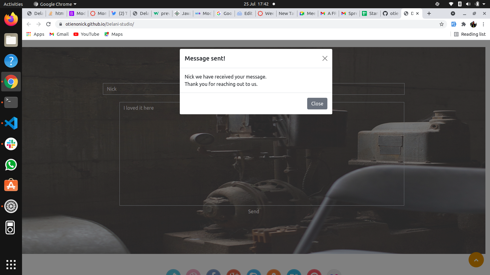

# DELANI STUDIO
## PROJECT DEVELOPER;
* Nick Otieno

## Project Description
### a landing page for a fictional studio.

## The website has;
* Images.
* Form validations.
## Technologies Used;
* HTML
* JAVASCRIPT
* CSS
* BOOTSTRAP
* JQUERY

### LICENCE

#### Contacts: 

    
        

#### : 0718849600
#### Email :otienonick70@gmail.com
#### &copy;2021 Nick Otieno.
